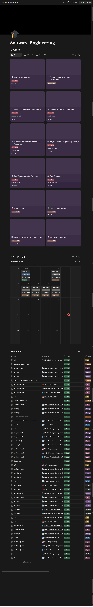

Taskly To-Do Manager 

Taskly is a lightweight task manager web app built with PHP, MySQL, HTML/CSS, and JavaScript . It includes secure authentication, a task dashboard with CRUD actions, filtering, and multiple ways to view tasks (Cards / Table / Calendar).

✨ Features:

- Authentication:

    - User registration + login + logout
    - Passwords stored securely using `password_hash()` + verified with `password_verify()`
    - Session-based authentication (protected dashboard route)

- Task Management:

    - Create / Edit / Delete / Complete tasks
    - Task fields include:
    - Title, description, due date, category, status, grading (optional)
  - Filter tasks by:
      - Category
      - Status (ex: all / completed / pending)

- Views:
    - Cards view
    - Table view
    - Calendar view
    - Calendar navigation uses AJAX (no full-page refresh)
 
🎥 Live Demo

▶️ Watch the live demo video: 
[Click here to view the Taskly demo](assets/Screen%20Recording%202025-12-26%20020202%20(1).mp4)


This video demonstrates:
- User registration and login valid such as 
  - Please enter valid domain either gmail.com, hotmail.com or yahoo.com
  - Passwords do not match
  - An email already exists with that account.
  - Password visibility options.
- Creating and managing tasks
- Switching between Cards, Table, and Calendar views
- Dynamic calendar navigation using AJAX
- Marking tasks as complete and deleting tasks

🧰 Tech Stack:

- Frontend: 
    - HTML
    - CSS 
    - JavaScript

- Backend:
    - PHP
    - Database: MySQL
    - Local dev: WAMP/XAMPP/MAMP (or any Apache + PHP + MySQL setup)
 
💡 Design Inspiration:

Taskly was inspired by my own custom Notion workspace, which I built to manage
courses, exams, and assignments.

This workspace combined multiple views *Cards, Table, and Calendar) to visualize
tasks at different levels of detail. Because this personalized system proved highly effective
for my workflow, I reimplemented the same concepts from scratch in Taskly using
PHP, MySQL, and JavaScript.

This project does not replicate a built-in Notion feature, but rather translates a
custom productivity workflow into a standalone web application designed specifically
for students.

Below is my notion workspace inspiration:


Database Overview:

- The system uses 2 primary tables

      USERS
      - Id
      - Email
      - Username
      - password_hash

      TASKS
      - id
      - user_id
      - title
      - description
      - due_date
      - category
      - status
      - grading
      - created at

Local Setup: There are a few steps to run Taskly on your local machine.

1. Install a Local Server Environment
    You will need a server stack that includes Apache, PHP, and MySQL, such as WAMP (Windows), XAMPP            (Windows / macOS / Linux) or MAMP (macOS).
    Ensure Apache and MySQL are running before continuing.

2️. Place the Project in the Server Root
    Move the Taskly folder into your server’s root directory:
    WAMP: C:/wamp64/www/
    XAMPP: C:/xampp/htdocs/
    MAMP: /Applications/MAMP/htdocs/
    
    Example:
    htdocs/
    └── Taskly/
        ├── login.html
        ├── tasks.php
        ├── db.php
        └── ...

3️. Create the Database
    Open phpMyAdmin (usually at http://localhost/phpmyadmin)
    Click New
    Create a database named: taskly

NOTE: ⚠️ The database name must match the name used in db.php.

4️. Create Required Tables
    Run the following SQL by navigating to the SQL prompt shown as the second in the top bar.
    Make sure to be inside the taskly database (it will display as dark grey in the left sidebar)

    CREATE TABLE users (
      id INT AUTO_INCREMENT PRIMARY KEY,
      email VARCHAR(191) NOT NULL UNIQUE,
      username VARCHAR(191) NOT NULL,
      password_hash VARCHAR(255) NOT NULL
    );

    CREATE TABLE tasks (
      id INT AUTO_INCREMENT PRIMARY KEY,
      user_id INT NOT NULL,
      title VARCHAR(255) NOT NULL,
      description TEXT,
      due_date DATE,
      category VARCHAR(100),
      status VARCHAR(50) DEFAULT 'pending',
      grading INT NULL,
      created_at TIMESTAMP DEFAULT CURRENT_TIMESTAMP,
      FOREIGN KEY (user_id) REFERENCES users(id) ON DELETE CASCADE
    );

Verify: 
SHOW TABLES;

5. Configure Database Connection

    Open db.php and confirm credentials:

   $host = "localhost";
   $user = "root";
   $pass = "";
   $db   = "taskly";

    Adjust values if your MySQL setup differs.

6️. Run the Application

Open your browser and go to: http://localhost/Taskly/login.html

You now have access to Taskly!

Future Improvements:

- Task reminders and notifications
- Shared / collaborative tasks
- Cloud deployment
- Mobile optimization
- Theme customization (light/dark mode)
- Calendar integration (Google / Apple)

👥 Team

Taskly was developed as a collaborative project with Hassan Rayan and Adiyat Jubair.

📁 Project Structure

```txt
Taskly/
├── db.php              # MySQL connection
├── login.html          # Login UI
├── login.css           # Login styling
├── login.js            # Login validation + password reveal
├── login.php           # Login handler (session start)
├── register.html       # Registration UI
├── register.php        # Registration handler (+ AJAX email check)
├── logout.php          # Destroys session
├── tasks.php           # Main dashboard (CRUD, filters, views)
├── tasks.js            # Dashboard interactivity + AJAX calendar nav
├── tasks.css           # Dashboard styling
└── assets/             # (optional) screenshots, logos, flowchart

